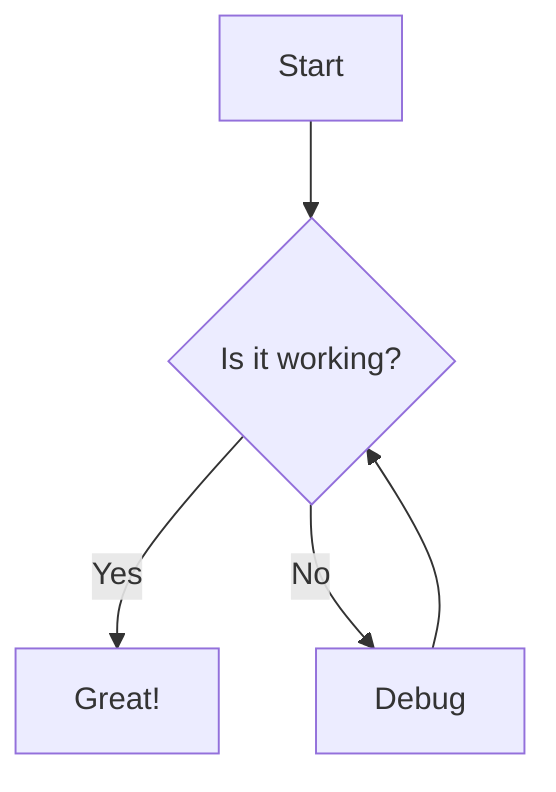
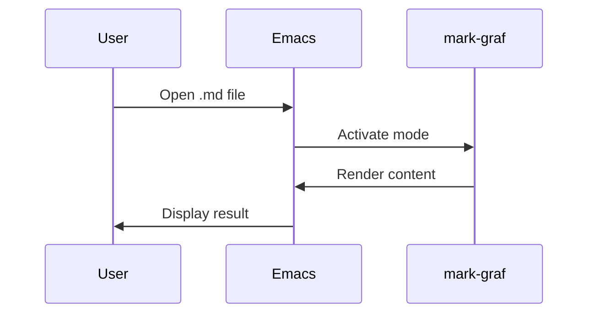
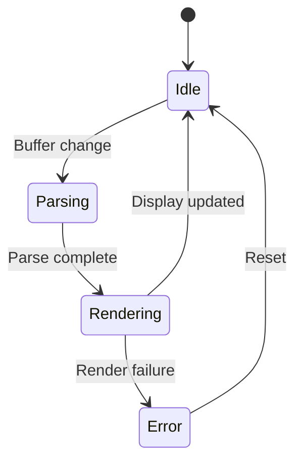
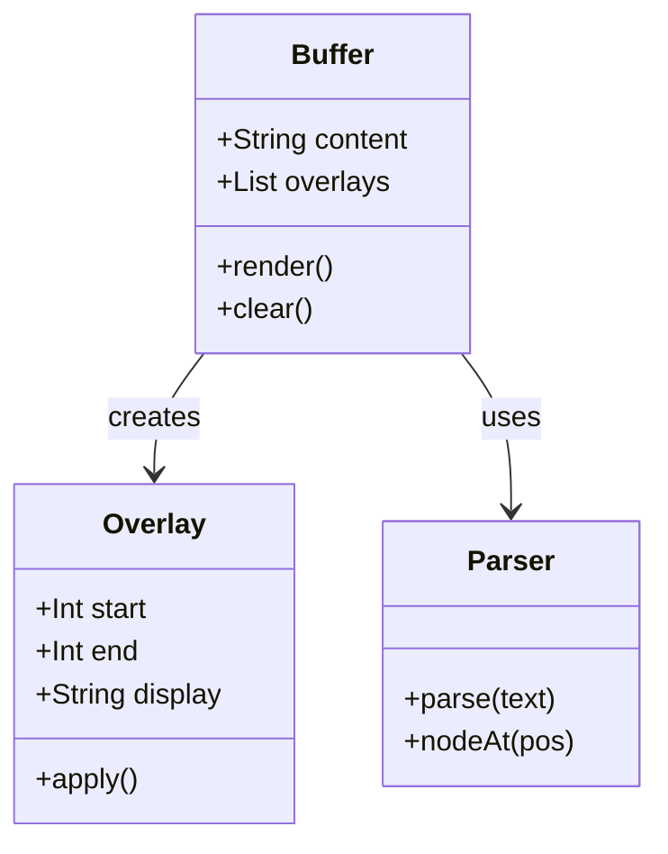
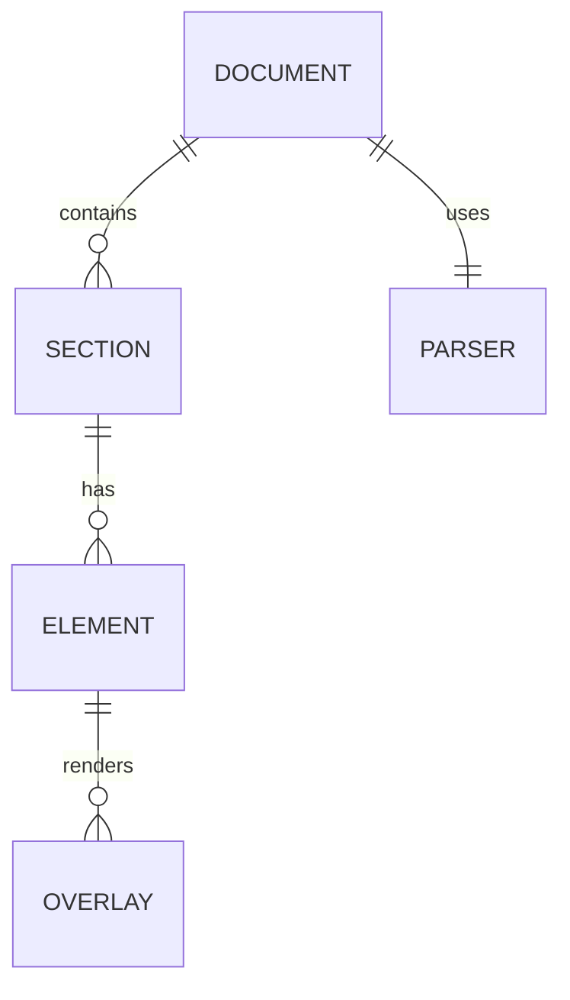

# mark-graf Sample Document

This is a sample markdown document to test **mark-graf** rendering capabilities.

## Inline Formatting

You can use **bold text**, *italic text*, `inline code`, and ~~strikethrough~~.

You can also combine them: ***bold and italic***, **bold with `code`**, etc.

## Links and Images

Here's a [link to GitHub](https://github.com).

And an image:


## Code Blocks

Inline code: `const x = 42;`

Fenced code block with syntax highlighting:

```javascript
function greet(name) {
  console.log(`Hello, ${name}!`);
  return true;
}

greet("World");
```

Python example:

```python
def fibonacci(n):
    """Generate Fibonacci sequence."""
    a, b = 0, 1
    for _ in range(n):
        yield a
        a, b = b, a + b

list(fibonacci(10))
```

Elisp example:

```elisp
(defun my-function (arg)
  "Docstring for my-function."
  (interactive "P")
  (message "Argument: %s" arg))
```

## Lists

### Unordered List

- First item
- Second item
  - Nested item
  - Another nested item
    - Even deeper
- Third item

### Ordered List

1. First step
2. Second step
   1. Sub-step A
   2. Sub-step B
3. Third step

### Task List

- [x] Completed task
- [ ] Incomplete task
- [x] Another done item
- [ ] Still to do

## Blockquotes

> This is a blockquote.
> It can span multiple lines.
>
> And even have multiple paragraphs.

Nested blockquotes:

> Level 1
>> Level 2
>>> Level 3

## Tables

| Name | Type | Description |
|------|------|-------------|
| mark-graf | Package | WYSIWYG markdown for Emacs |
| tree-sitter | Library | Incremental parsing |
| overlay | Object | Buffer decoration |

| Left | Center | Right |
|:-----|:------:|------:|
| L1 | C1 | R1 |
| L2 | C2 | R2 |

## Horizontal Rules

Above the rule.

---

Below the rule.

## Math (LaTeX)

Inline math: $E = mc^2$

Display math:

$$
\int_{-\infty}^{\infty} e^{-x^2} dx = \sqrt{\pi}
$$

## Mermaid Diagrams











## Headings at Different Levels

### Level 3 Heading

#### Level 4 Heading

##### Level 5 Heading

###### Level 6 Heading

## Footnotes

Here's a statement with a footnote[^1].

And another one[^note].

[^1]: This is the first footnote.
[^note]: This is a named footnote.

## HTML (passthrough)

<details>
<summary>Click to expand</summary>

This content is hidden by default.

</details>

<kbd>Ctrl</kbd> + <kbd>C</kbd>

---

*End of sample document*
